# Projeto Integração Api's

Este projeto foi desenvolvido com entuito de expor minhas habilidades com C# e .Net Core,
o objetivo alvo é desenvolvimento de duas Api's que devem se comunicar entre si, outros objetivos relacionados são, expor meu nível de maturidade com o paradigma orientado a objetos, arquitetura de software, propriedades  e princípios de projetos, como por exemplo Coesão, Acoplamento, Encapsulamento, Extensibilidade e SOLID.

## Arquitetura
  ambas as Api's seguem um padrão arquitetural em camadas, o qual permite ter Coesão, Baixo acoplamento e Extensibilidade, encapsulamento a nível de arquitetura.
  As camadas são: Controllers, Domain e Infrastructure, sendo que a camada superior acessa apenas a camada inferior mais próxima.

<pre>
Estrutura das Camadas:
  Controllers
  Domain
  Infrastructure

Formas de acesso:
  Controllers -> Domain
  Domain -> Infrastructure   
  Infrastructure -> com terceiros (BD,Api's e etc.)
</pre>
  
  
## Api1
 Descrição: Esta api possui um endpoint o qual retorna um json com valor que representa um taxa padrão

 ### Estrutura
  <pre>
    /
    Controllers/
                TaxaJuros.cs (Endpoint)               
    Domain/     
          Models/
                Taxa.cs (representação de uma taxa)
  </pre>

## Chamadas a Api1
  Get: https://localhost:5001/taxajuros

## Ap2
Descrição: Esta api possui dois endpoints, um que retorna o calculo de juros composto dado uma valor inicial e a quantidade de meses e retorna o montante calculado, e outro retonar o link do repositório no github onde se encontra este projeto.

 ### obs: a taxa utilizada para o calculo de juros composto vem da Ap1.

 ### Estrutura
  <pre>
    Api2/
      Controllers/
                  CalculaJuros.cs (Endpoint) 
                  ShowMeTheCode.cs (Endpoint)
      Domain/     
            Models/
                  Montante.cs (Classe modelo)
                  Code.cs (Classe modelo)         
      Infrastructure/
                    ApiService/
                              Models/
                                    Ap1/
                                      Taxa.cs (Classe modelo)
                                    GitHub/
                                          Repo.cs (Classe modelo)
                              ApiService.cs (Classe genérica de acesso a Api's)
      Api2.Testes/
                MontanteTestes.cs (Classe de Unit teste da entidade montante.)
  </pre>

  ## Chamadas a Api2
  Get: https://localhost:5003/calculajuros?valorInicial={valor decimal}&meses={valor inteiro}

  Get: https://localhost:5003/showmethecode

## Prova de Conceito POC
Prova de conceito onde testei como fazer chamadas a api's, nela testei duas maneiras um com o framework Refit e a outra HttpClient.
<pre>
    POC-Consumindo-Api1/
                      net_http/
                              Models/
                                    Taxa.cs
                              ConsumoHtppService.cs
                      Refit/
                            Interfaces/
                                      ITaxaApi1Service.cs
                            Models/
                                  TaxaResponse.cs
</pre>

## Testes
  Os teste unitários da aplicação foram desenvolvidos com Xunit, que é um framework para criação de teste da plataforma .net.  

## Documentação das Api's
A documentação dos endpoints das api's foram feitas com swagger, que de um modo resumido é um ferramenta de automação do processo de documentação de api's que pode ser utilizada com várias linguagens.

  ## Rodando o Projeto na sua máquina

  Beleza agora que você já tem um noção do projeto, pode cloná-lo para dar uma olhada no código e executá-lo.

  Para isso você precisará ter na sua máquina:
    .net core 3.1 e o Visual Studio 2019 instalados.

  ### 1° Passo - Clonando o projeto

  Ao abrir o Visual Studio no menu lateral Introdução click em "Clonar um repositório".

  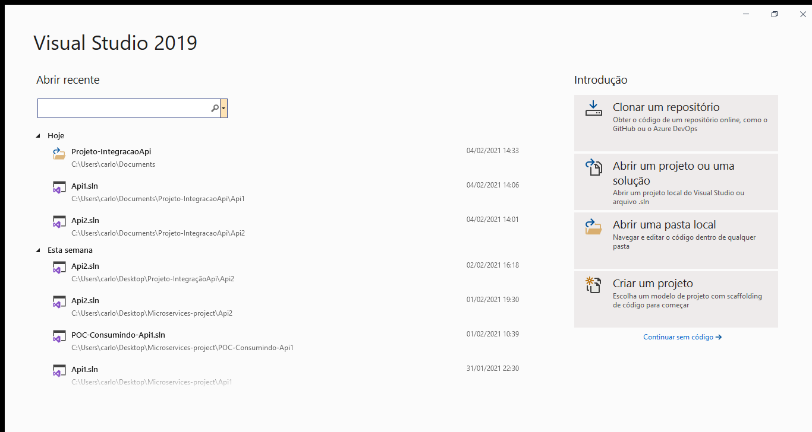

  Na tela seguinte no input "Local do repositório", cole a url do repositório:
  https://github.com/carloshenriqueDEV/Projeto-IntegracaoApi.git
  e em seguida click em clonar.

  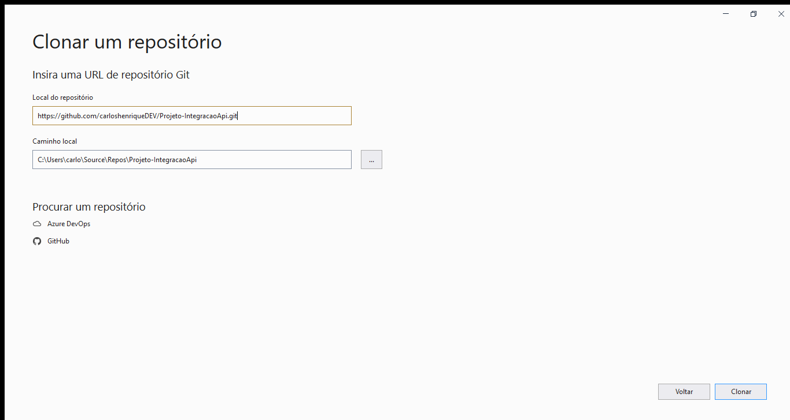

## 2° Passo - Ajustando e rodando o projeto
  obs: esses os procedimentos a seguir devem ser feito nas duas Api's para que o projeto possa rodar perfeitamente.

  ## Api1
  Após clonado, na aba Gerenciador de Soluções você terá a visualização de todo o projeto.

  ### Configurando o path do arquivo de documentação xml
  Esse ajuste deve ser feito devido ao swagger, para o correto funcionamento ele necessita que o projeto possua um arquivo de documentação xml. Este arquivo quando gerado deve ser informado o local onde mesmo será salvo.

  Na aba Gerenciador de Soluções entre na pasta da Api1, nela você um pasta Api1 onde estão os arquivos fontes da Api e o arquivo Api1.sln, click no Arquivo .sln e aguarde o projeto carregar, após o carregamento da solução selecione o projeto como na imagem a baixo. 
  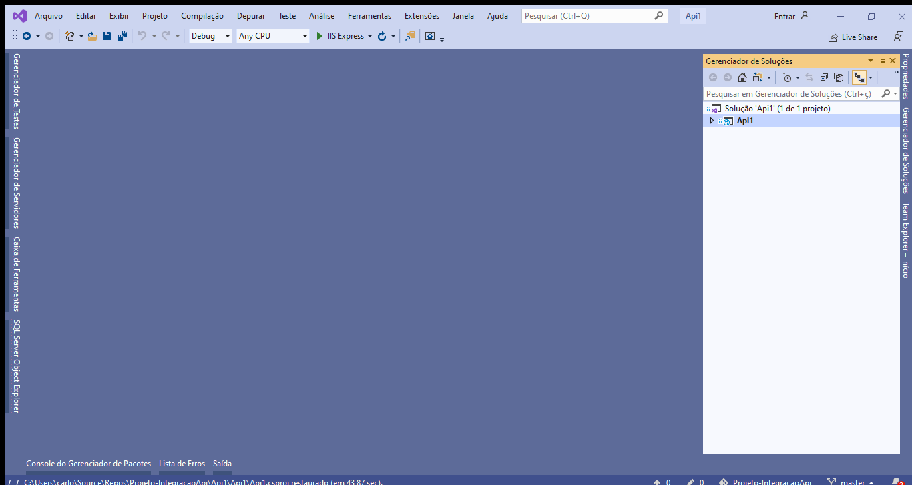
  Com o projeto selecionado use o atalho alt + enter,
  o comando anterior abrirá as proriedades do projeto, nessa tela selecione a opção Compilar, vide a imagem abaixo.
  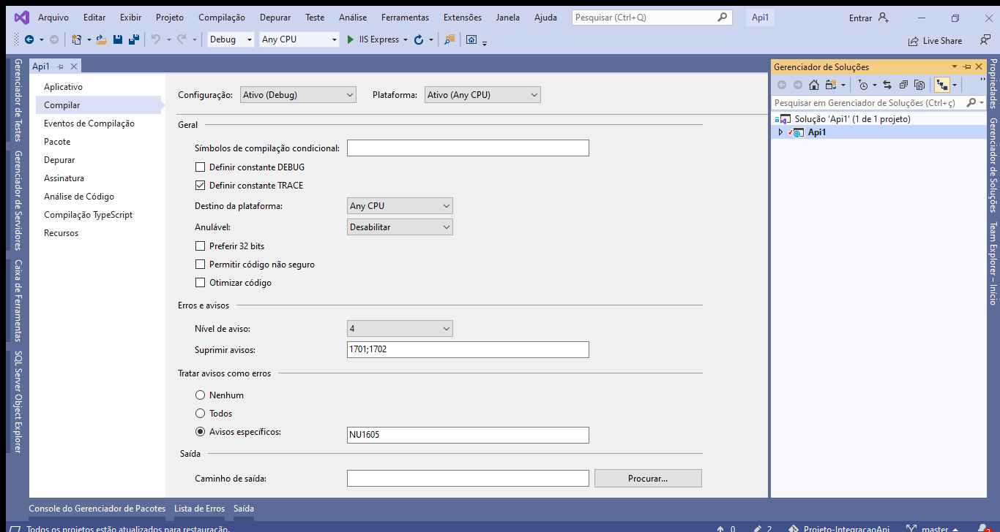
  Na sequência procure a opção Saída e no checkbox Arquivo de documentação XML desmarque-o e o marque-o novamente, feito isso salve e pronto o path já está configurado.
  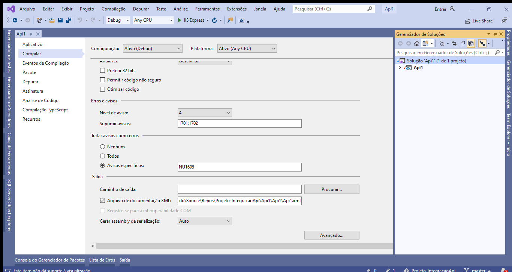
  Tendo configurado o path podemos então roda a plicação.
  Utiliza o seguinte comando para abri o terminal PowerShell ctrl + '.
  com terminal aberto digite os seguintes comandos
  cd Api1 (esse comando fará você entrar na pasta da Api1),
  e depois cd Api1 novamente (esse outro fará você entra na pasta dos fontes da Api1),
  e por ultimo digite dotnet run (esse comando vai fazer o build e levantará a api1 no servidor Kestrel).
  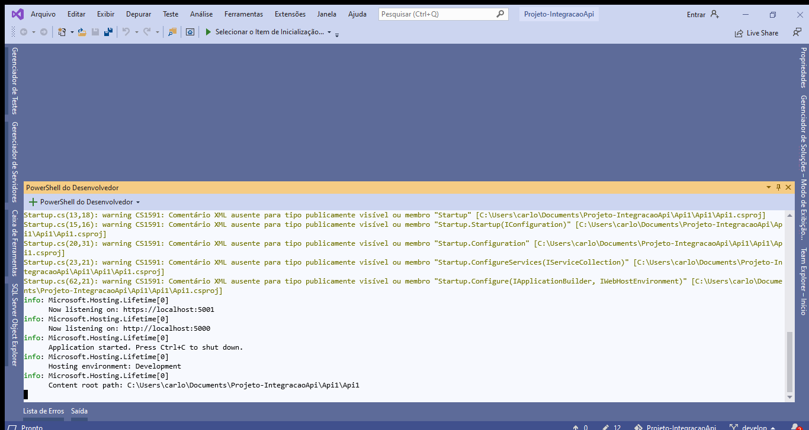
  Com a Api1 rodando acesse no navegador a seguinte url https://localhost:5001/swagger/index.html, ela carregará o Swagger mostrando os endpoint da Api1, nessa página você pode fazer chamadas a Api e fazer testes.
  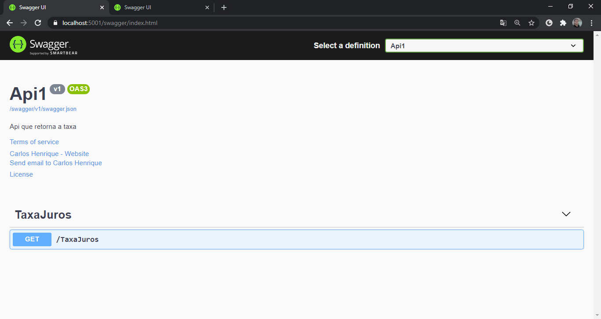

  ### Api2
  Após iniciar a Api1, vamos inicie a Api2 o procedimento é o mesmo, mas para fim didáticos documentei.

  Na aba Gerenciador de Soluções entre na pasta da Api2, nela você um pasta Api2 onde estão os arquivos fontes da Api e o arquivo Api2.sln, click no Arquivo .sln e aguarde o projeto carregar, após o carregamento da solução selecione o projeto como na imagem a baixo. 
  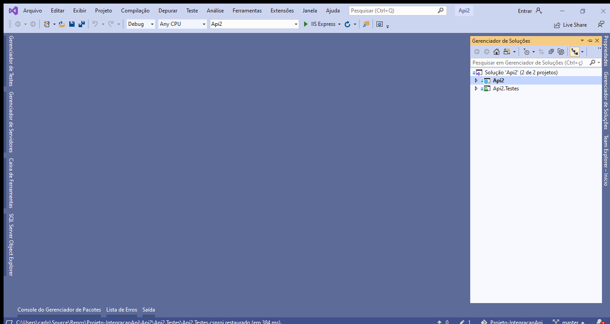
  Com o projeto selecionado use o atalho alt + enter,
  o comando anterior abrirá as proriedades do projeto, nessa tela selecione a opção Compilar, vide a imagem abaixo.
  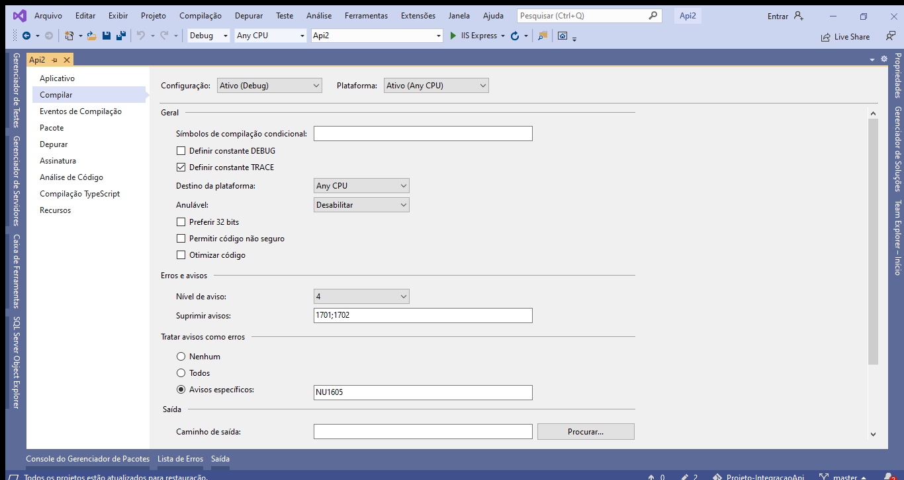
  Na sequência procure a opção Saída e no checkbox Arquivo de documentação XML desmarque-o e o marque-o novamente, feito isso salve e pronto o path já está configurado.
  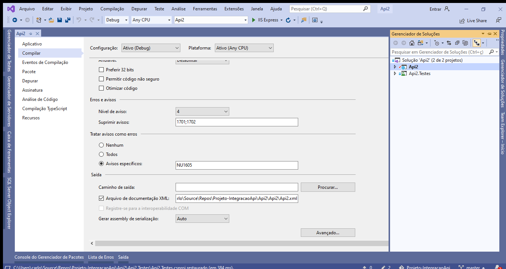
  Agora abra um novo terminal click no botão + PowerShell do Desenvolvedor
  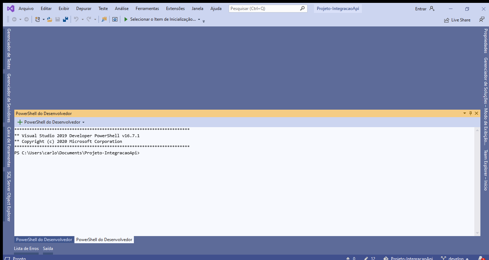
  com o novo terminal aberto digite os seguintes comandos
  cd .. (Casso novo terminal você esteja na pasta Api1, use esse comando para voltar ao diretório raiz do projeto.)
  cd Api2 (esse comando fará você entrar na pasta da Api2),
  e depois cd Api2 novamente (esse outro fará você entra na pasta dos fontes da Api2),
  e por ultimo digite dotnet run (esse comando vai fazer o build e levantará a Api2 no servidor Kestrel).
  
  Com a Api2 rodando acesse no navegador a seguinte url https://localhost:5003/swagger/index.html, ela carregará o Swagger mostrando os endpoint da Api2, nessa página você pode fazer chamadas a Api e fazer testes.
  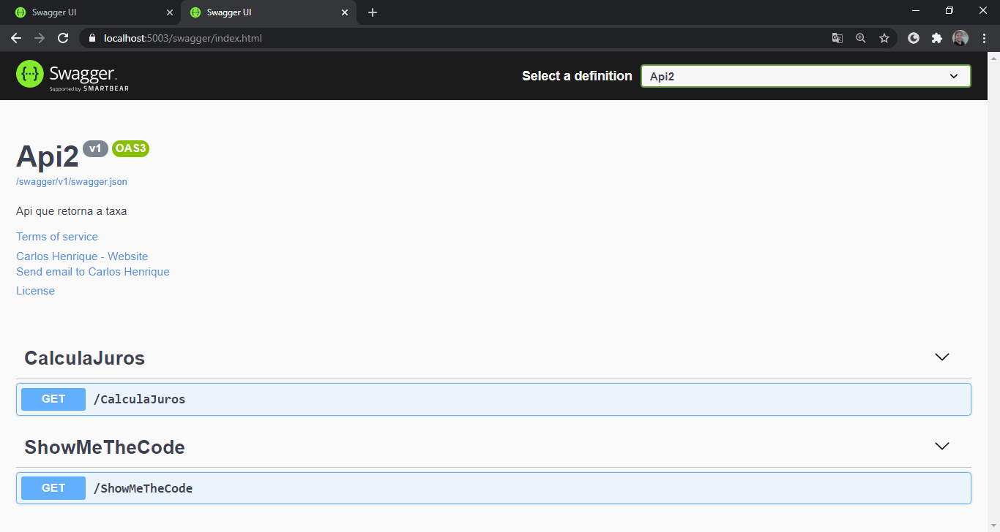